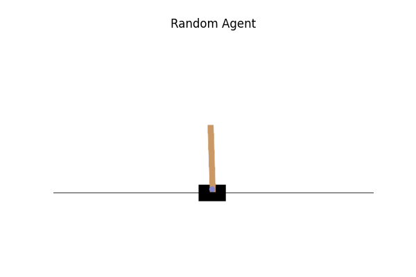
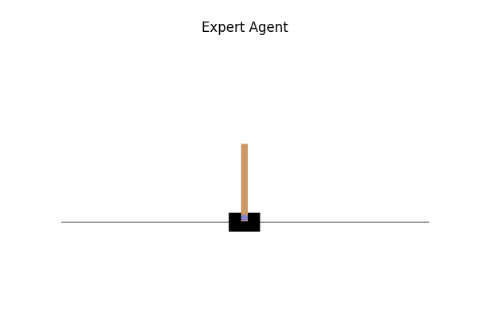

# 03. CartPole 전문가 데이터 수집

---

## CartPole 환경이란?

막대기가 달린 카트를 좌우로 움직여 막대기가 쓰러지지 않게 균형을 잡는 게임.

```
        |
        |  ← 막대기 (쓰러지면 실패)
        |
  [====카트====]
  ←          →
  (왼쪽/오른쪽 이동)
```

| | 내용 |
|---|---|
| 관찰값 | 4개 (카트 위치, 카트 속도, 막대 각도, 막대 각속도) |
| 행동 | 2개 (0: 왼쪽, 1: 오른쪽) |
| 성공 기준 | 200 스텝 이상 버티기 |

---

## 전체 흐름

```
환경 설치 및 랜덤 플레이
        ↓
전문가 에이전트 정의
        ↓
랜덤 vs 전문가 시각화 (GIF)
        ↓
전문가 데이터 수집 (states, actions 저장)
        ↓
04_behavior_cloning에서 학습 재료로 사용
```

---

## 랜덤 vs 전문가 비교

| | 랜덤 에이전트 | 전문가 에이전트 |
|---|---|---|
| 행동 방식 | 무작위 (0 또는 1) | 막대 각도 + 각속도 기반 규칙 |
| 평균 스텝 | 10~44 스텝 | 200 스텝 (최대) |
| 총 보상 | 10~44 | 200 |

 

---

## 전문가 정책 (Expert Policy)

```python
def expert_policy(obs):
    pole_angle = obs[2]      # 막대 각도
    pole_velocity = obs[3]   # 막대 각속도

    # 각도와 각속도를 함께 고려
    # → 각도만 보면 이미 늦을 수 있어서 각속도도 반영
    if pole_angle + 0.1 * pole_velocity > 0:
        return 1  # 오른쪽으로 기울고 있음 → 오른쪽 이동
    else:
        return 0  # 왼쪽으로 기울고 있음 → 왼쪽 이동
```

---

## 수집된 데이터

```
에피소드 수:     50회
전체 스텝 수:    10,000
states shape:  (10000, 4)
actions shape: (10000,)
```

**첫 번째 데이터 예시:**
```
state:  [ 0.00679997  -0.00795248  -0.04157381  -0.03535334]
         카트 위치      카트 속도      막대 각도      막대 각속도
         (거의 중앙)    (거의 정지)    (약간 왼쪽)    (왼쪽으로 기우는 중)

action: 0  →  왼쪽으로 이동
```

막대가 왼쪽으로 기울고 있으니 왼쪽으로 이동해 균형을 잡으려는 것.

---

## Behavior Cloning과의 연결

이 10,000개의 (state, action) 쌍이 Behavior Cloning 학습의 재료가 된다.

```
전문가 데이터 (state, action)
        ↓
Behavior Cloning 모델 학습
"이 상황(state)에서 전문가는 이렇게 행동(action)했다"
        ↓
학습된 모델이 전문가처럼 행동하도록
```

MNIST에서 이미지 → 숫자를 학습한 것처럼,
Behavior Cloning은 상태 → 행동을 학습하는 것.

---

## 참고

- 다음 단계: [04_behavior_cloning](../04_behavior_cloning/README.md)
- Imitation Learning 개념: [../00_concepts/](../00_concepts/)
