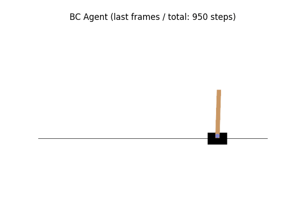
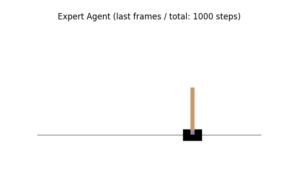
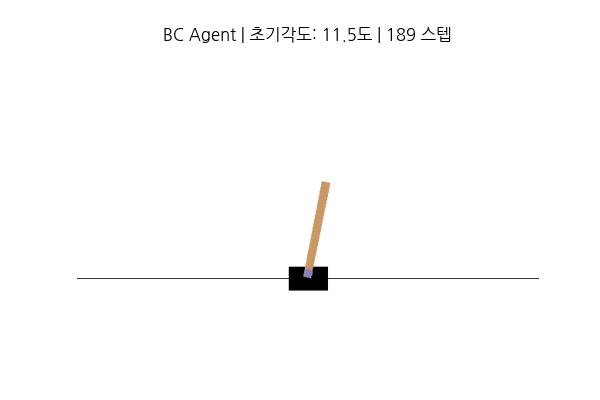
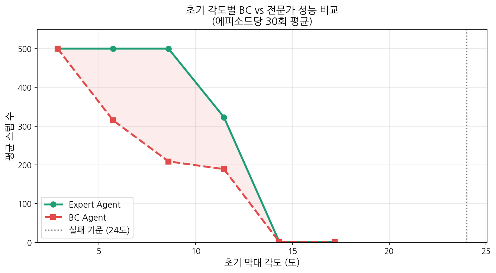

# 05. Behavior Cloning의 한계

---

## 왜 이 단계가 필요한가

04단계에서 BC 모델이 200 스텝 기준으로 전문가와 동일한 성능을 보였음.

```
랜덤 에이전트: 10~44 스텝
BC 모델:      200.0 스텝  ← 전문가와 동일
전문가:       200.0 스텝
```

하지만 200 스텝은 CartPole-v1의 기본 최대값.  
이것만으로는 BC가 진짜 잘하는 건지, 그냥 버티는 건지 알 수 없음.  
더 다양한 조건에서 테스트해서 BC의 실제 한계를 직접 확인하는 것이 목표.

---

## 테스트 1 — 최대 스텝 1000으로 늘려서 테스트

```
BC 모델:  941.9 스텝
전문가:  1000.0 스텝
랜덤:      22.9 스텝
```

200 스텝에서는 차이가 없었지만 1000 스텝으로 늘리니 58 스텝 차이가 생기기 시작함.  
BC가 긴 시간이 지나면서 조금씩 불안정해지는 것이 보임.

**BC vs 전문가 마지막 100 프레임 비교 (1000 스텝 테스트):**

 

전문가(오른쪽)는 막대가 꼿꼿하게 유지되는 반면,  
BC(왼쪽)는 950 스텝에서 막대가 기울어져 있는 것이 보임.

---

## 테스트 2 — 극단적인 초기 상태 (Distribution Shift 확인)

막대를 많이 기울인 채 시작해서 BC가 한 번도 본 적 없는 상황을 만듦.

```
각도(rad)  각도(도)    BC      전문가
0.05       2.9°    500.0    500.0  ← 정상 범위, 차이 없음
0.10       5.7°    437.0    500.0  ← BC 슬슬 흔들림
0.20      11.5°    230.0    323.0  ← BC 급격히 무너짐
0.30      17.2°      1.0      1.0  ← 둘 다 즉시 실패
0.40      22.9°      1.0      1.0  ← 실패 기준(24도)에 너무 가까움
```

**초기각도 11.5도에서의 비교:**

 

같은 11.5도에서 시작했지만 BC(189 스텝)와 전문가(323 스텝)의 차이가 명확히 보임.

### Distribution Shift란?

```
BC 학습 데이터:
  전문가가 항상 막대를 잘 잡고 있는 상황만 봄
  → 초기 각도 거의 0도에 가까운 데이터만 학습

실제 테스트:
  초기 각도 11도 → "이런 상황은 학습한 적 없어" → 대처 못 함
  초기 각도 17도 → 즉시 실패
```

---

## 테스트 3 — 성공률 비교 그래프

각도별 30회 평균으로 더 안정적인 결과 측정.



빨간 영역이 Distribution Shift로 인한 BC의 한계를 시각적으로 보여줌.  
전문가는 10도까지 500 스텝을 유지하지만 BC는 5도만 넘어도 급격히 무너짐.

### 주의: BC가 우연히 전문가보다 잘할 수도 있음

```
0.20도에서 BC(340) > 전문가(323) 가 나온 케이스도 있었음
```

이유:
- BC 모델이 매번 랜덤 초기화로 학습되어 실행마다 성능이 다름
- 에피소드 수가 적으면 운에 따라 결과가 달라짐
- 규칙 기반 전문가도 완벽하지 않아서 특정 상황에서 BC가 우연히 더 잘할 수 있음

→ 따라서 테스트는 충분한 횟수(30회 이상)로 평균을 내야 신뢰할 수 있음.

---

## BC의 핵심 한계 정리

```
1. Distribution Shift
   학습 데이터 분포를 벗어나면 급격히 무너짐
   → IRL 계열이 해결하려는 문제

2. Multimodal Action Distribution
   같은 상황에서 여러 올바른 행동이 있으면
   BC는 평균값으로 수렴 → 어정쩡한 행동
   → Diffusion Policy가 해결

3. 학습 불안정성
   매번 랜덤 초기화로 결과가 달라짐
   → 충분한 데이터와 테스트 횟수 필요
```

---

## 다음 레포로 이어지는 흐름

```
BC 한계 직접 확인 (이 단계)
        ↓
"이걸 어떻게 해결하지?"
        ↓
📁 pytorch-diffusion-study (다음 레포 예정)
  ├── 01_diffusion_basics     ← DDPM 이해
  ├── 02_diffusion_policy     ← 행동 생성에 적용
  └── 03_bc_vs_diffusion      ← BC와 성능 비교

Distribution Shift  → IRL 계열이 해결
Multimodal 문제     → Diffusion Policy가 해결
```

---

## 개념 참고

- Distribution Shift / Imitation Learning: [../00_concepts/imitation_learning.md](../00_concepts/imitation_learning.md)
- Diffusion Policy: [../../riro-paper-study/dispo/background_diffusion_policy.md](../../riro-paper-study/dispo/background_diffusion_policy.md)
